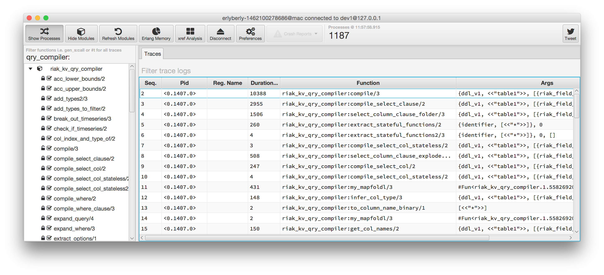

# erlyberly

erlyberly is a UI for the erlang dbg module, allowing you to trace functions calls on a remote erlang node.

### Current State

erlyberly is under active development.  It is intended as a dev tool, do not use it in production.

### Compiling

You will need JDK 8 and Maven to compile erlyberly and JDK/Java 8 to run it.  Download it [here](http://www.oracle.com/technetwork/java/javase/downloads/jdk8-downloads-2133151.html).

erlyberly loads an erlang module to the remote node and then uses RPC to run traces and collect stats.  For convenience I have bundled the beam code in the source as well as the original erlang source.  If you want to recompile the beam code for yourself run the following command from the project directory:

    erlc -o src/main/resources/erlyberly/beam/ src/main/resources/erlyberly/beam/erlyberly.erl

To build the jar:

    mvn clean install assembly:single

This creates a runnable jar in the target directory.  Either double click it if your OS supports that or run a terminal:

    java -jar erlyberly-n.n.n-jar-with-dependencies.jar