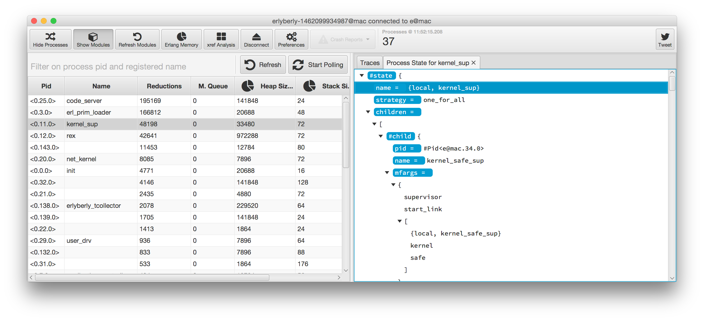

# erlyberly

erlyberly is a debugger for erlang, and [elixir](https://twitter.com/andy_till/status/539566833515626497). Instead of setting break points in code, a trace is set on a function and calls to it are logged without blocking your processes.

If you are using `io:format/2` or lager for debugging then erlyberly can save you time.  There is no recompliation and no log statements need to be removed (or not!) afterwards.

### Features and How To

##### Set traces on functions

All the modules loaded by the VM appear in the module tree.  Expand one of modules to view the functions, double clicking the star toggles tracing on and off.  Any calls made to that function by any process will now be shown in the right hand list.  Press `ctrl+t` while a function is selected to toggle a trace without touching your mouse.

##### See calls to functions and their results

Double click on a trace to see a breakdown of the arguments and results of the function call.

##### See calls that threw exceptions

Exceptions are highlighted.

##### See incomplete calls

A call that hasn't returned yet is highlighted in yellow.

##### Sequential Tracing of messages

Sequential Tracing ([seq_trace](http://www.erlang.org/doc/man/seq_trace.html)) is message tracing from process to process, allowing you to see the message flow through the application.

To start a seq trace right click on a function and select **Seq Trace (experimental)**, a Window will pop up that will display the trace messages.  When the traced function is called, messages sent afterwards are shown in the window.

This functionality is experimental and highly likely to bork the remote node under test and erlyberly.  Once a seq trace is set the only way to stop it is to terminate erlyberly or run `seq_trace:reset_trace()` in the shell of the remote node.

##### Get the process state

Get and display the state of a process. 

This uses [sys:get_state/1](http://www.erlang.org/doc/man/sys.html#get_state-1) under the hood and so has the same limitations. Processes that do not support the system message may not respond.

If the value is a record that is compiled into the module of the processes initial call then the record name and field names will appear highlighted. Records that are not known by the module at compile time will not be highlighted.

##### Attach to any running system

erlyberly connects as an erlang node to the node you want to trace. Once connected it can trace your application code, 3rd party modules and modules that are part of the erlang standard libary.

Just make sure that the `runtime_tools` application is available in the code path.  If the node was run using erl directly then it will be available by default.

erlyberly is not meant to trace production systems.  There is no overload protection as per redbug.

##### Filtering

Easily find what you're looking for by using the filter fields.

|        Filter       |                             What is searched?                             |
| ------------------- | :-----------------------------------------------------------------------: |
| processes           |                          pid and registered name                          |
| modules & functions | modules, functions can be filtered using a colon i.e. `my_module:my_func` |
| trace logs          |                        All text shown in the trace                        |

The process and trace filters support **or** and **not** filters, module filtering does not support this.  By entering `!io` in the trace filter, all traces containing the text `io` will be hidden, by entering `lists|proplists` only traces containing the text `lists` or `proplists` will be shown.

If the filter is empty then all data is shown.

##### Trace between restarts

When the target node VM gets restarted, erlyberly tries to reconnect and reapply the traces you had previously set.  This is great for your dev workflow.  Make a change, restart and your traces will be there waiting for you to retest.

If you hotload code during development either manually or using a reloader like [sync](https://github.com/rustyio/sync) then you may notice that reloading a module removes all traces on it.  erlyberly listens for modules being reloaded and reapplies any traces that were previously applied to it, without interrupting you!

##### See graphs for process memory usage

Open up the process table, next to the memory usage columns there is a pie chart icon.  Clicking one of these icons shows the memory usage of all the processes that were selected in the table.

##### See the state of a process

Right click on a process in the process table and click on *"Get process state"*.  This is possible only if the process handles system messages, OTP behaviours do.

##### Cross platform

Tested on Ubuntu and Windows 7/8.  Also seen on [OS X](http://t.co/kzXppo5GEt).

### Shortcuts

|   Keys   |                            Action                            |
| -------- | :----------------------------------------------------------: |
| `ctrl+m` |         Toggle visibility of modules and functions.          |
| `ctrl+p` |               Toggle visibility of processes.                |
| `ctrl+t` | Toggle tracing for the selected function in the module tree. |

### How to get it

Go to the github [releases section](https://github.com/andytill/erlyberly/releases) and download the runnable jar.  In Windows you can double click to run it or from the console in any OS `java -jar erlyberly-runnable.jar`.

You will need Java 8 run erlyberly, download it [here](http://www.oracle.com/technetwork/java/javase/downloads/jdk8-downloads-2133151.html).  There are no other dependencies.

If you are having issues try compiling the erlyberly beam against the erlang/OTP version it is being run against and building the jar again, instructions below.

### Trouble Shooting

erlyberly must have epmd running on the machine as it is running.  Otherwise it will not be able to connect to the remote node with an error about Name Servers.  The easiest way to run epmd is to run the following command in the shell `erl -sname hi`, this requires erlang to be installed and on the `PATH`.

### Compiling

You will need JDK 8 and Maven to compile.  erlyberly loads an erlang module to the remote node and then uses RPC to run traces and collect stats.  For convenience I have bundled the beam code in the source as well as the original erlang source.  If you want to recompile the beam code for yourself run the following command from the project directory:

    erlc -o src/main/resources/erlyberly/beam/ src/main/resources/erlyberly/beam/erlyberly.erl

Install Maven dependencies that are not in Maven Central.

    mvn install:install-file -Dfile=OtpErlang.jar -DgroupId=org.erlang.otp -DartifactId=jinterface -Dversion=1.5.12 -Dpackaging=jar

To build the jar:

    mvn clean install assembly:single

This creates a runnable jar in the target directory.  Either double click it if your OS supports that or run a terminal:

    java -jar erlyberly-n.n.n-jar-with-dependencies.jar

You'll also need the [floaty-field](https://github.com/andytill/floaty-field) library installed in your local Maven cache.

### Roadmap

Some things that are important.

1. Bug fixing and stability for current features is number one priority right now.  Help by contributing issue reports.
2. seq_trace visualisation with graphs.
3. More statistics on the running system, such as memory and CPU.
4. Beat CAP.

erlyberly is meant to be a complementary to observer so there will be no attempt to implement features such as the supervisor hierarchy graph.